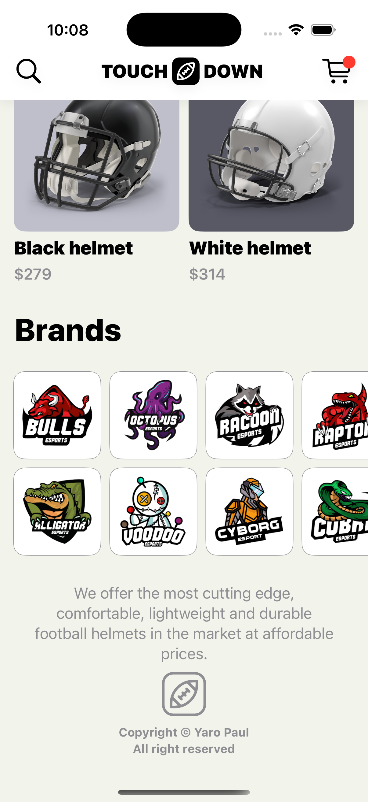
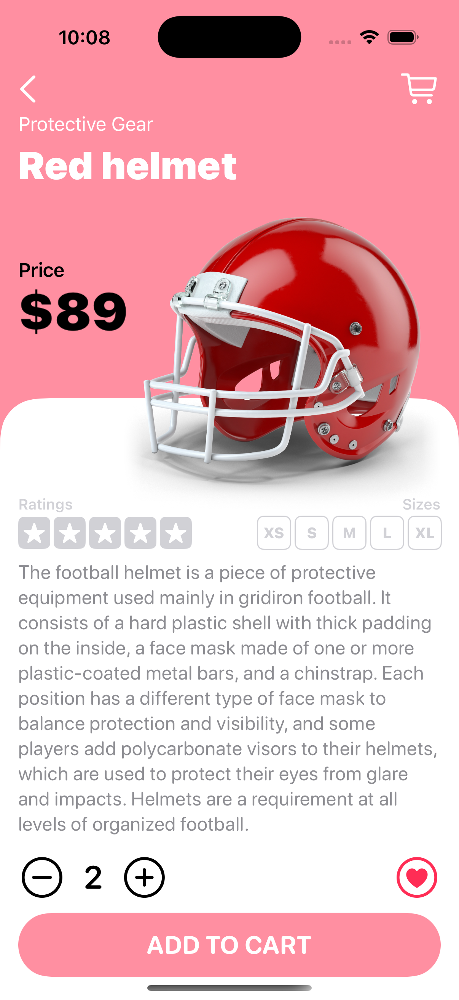

# Touchdown

An elegant e-commerce iOS application for American football gear built with SwiftUI. This project showcases modern iOS development practices, including state management, custom UI components, and responsive design patterns.

## Overview

Touchdown is a fully functional e-commerce app that demonstrates advanced SwiftUI concepts through a beautiful, intuitive shopping experience for football equipment. The app features a product catalog, detailed product views, category browsing, and brand discovery.

## Screenshots

<p align="center">
  
  
  
</p>

## Features

- **Dynamic Home Feed**: Scrollable product catalog with featured items carousel
- **Product Categories**: Browse football gear by category with intuitive grid layout
- **Brand Directory**: Explore products by popular football equipment brands
- **Product Details**: Comprehensive product information with:
  - Dynamic color-themed backgrounds
  - Product ratings and size selection
  - Quantity adjustment controls
  - Add to cart functionality
  - Favorite/wishlist feature
- **Smooth Animations**: Fluid transitions and haptic feedback
- **Custom UI Components**: Reusable, modular SwiftUI views
- **JSON Data Integration**: Products, categories, brands, and featured players loaded from local JSON files

## Tech Stack

- **Language**: Swift
- **Framework**: SwiftUI
- **Architecture**: MVVM (Model-View-ViewModel)
- **State Management**: @EnvironmentObject, @Published properties
- **Minimum iOS Version**: iOS 14.0+
- **Xcode Version**: 12.0+

## Requirements

- macOS 11.0 or later
- Xcode 12.0 or later
- iOS 14.0+ deployment target
- Swift 5.3 or later

## Installation

1. Clone the repository:
```bash
git clone https://github.com/yourusername/SwiftUIProject8-Touchdown.git
cd SwiftUIProject8-Touchdown
```

2. Open the project in Xcode:
```bash
open SwiftUIProject8-Touchdown.xcodeproj
```

3. Select your target device or simulator

4. Build and run the project (⌘+R)

## Project Structure

```
SwiftUIProject8-Touchdown/
├── APP/
│   ├── SwiftUIProject8_TouchdownApp.swift  # App entry point
│   ├── ContentView.swift                   # Main view container
│   └── ProducDetailView.swift              # Product detail screen
├── Model/
│   ├── ProductModel.swift                  # Product data model
│   ├── CategoryModel.swift                 # Category data model
│   ├── BrandModel.swift                    # Brand data model
│   └── PlayerModel.swift                   # Featured player model
├── View/
│   ├── Home/                               # Home screen components
│   │   ├── NavigationBarView.swift
│   │   ├── LogoView.swift
│   │   ├── FeaturedTabView.swift
│   │   ├── FeaturedItemView.swift
│   │   ├── CategoryGridView.swift
│   │   ├── CategoryItemView.swift
│   │   ├── ProductItemView.swift
│   │   ├── BrandGridView.swift
│   │   ├── BrandItemView.swift
│   │   ├── TitleView.swift
│   │   ├── SectionView.swift
│   │   └── FooterView.swift
│   └── Detail/                             # Product detail components
│       ├── NavigationBarDetailView.swift
│       ├── HeaderDetailView.swift
│       ├── TopPartDetailView.swift
│       ├── RatingsSizesDetailView.swift
│       ├── QuantityFavouriteDetailView.swift
│       └── AddToCartDetailView.swift
├── Data/                                   # JSON data files
│   ├── product.json
│   ├── category.json
│   ├── brand.json
│   └── player.json
├── Extension/
│   └── CodableBundleExtension.swift        # JSON decoding utilities
├── Utility/
│   ├── Constant.swift                      # App constants
│   ├── CustomShape.swift                   # Custom shape definitions
│   └── shop.swift                          # Shop state management
└── Assets.xcassets/                        # Image and color assets
    ├── Brand/
    ├── Category/
    ├── Helmet/
    ├── Player/
    └── Logo/
```

## Data Models

### Product
```swift
struct Product: Codable, Identifiable {
    let id: Int
    let name: String
    let image: String
    let price: Int
    let description: String
    let color: [Double]  // RGB color values
}
```

### Category
Categories include helmets, jerseys, gloves, shoes, and various football equipment.

### Brand
Featured football equipment brands displayed in a grid layout.

### Player
Featured professional football players showcased in the carousel.

## Key Components

### Home View Components

- **NavigationBarView**: Custom navigation bar with logo and action buttons
- **LogoView**: App branding display
- **FeaturedTabView**: Horizontal scrolling carousel for featured items
- **CategoryGridView**: Grid layout for product categories
- **ProductItemView**: Individual product card with image and price
- **BrandGridView**: Grid displaying partner brands
- **FooterView**: App footer with additional information

### Detail View Components

- **NavigationBarDetailView**: Product detail navigation
- **HeaderDetailView**: Product name and image header
- **TopPartDetailView**: Primary product information
- **RatingsSizesDetailView**: Star ratings and size selection
- **QuantityFavouriteDetailView**: Quantity controls and wishlist button
- **AddToCartDetailView**: Cart action button

## State Management

The app uses SwiftUI's `@EnvironmentObject` pattern for global state management:

```swift
class Shop: ObservableObject {
    @Published var showingProduct: Bool = false
    @Published var selectedProduct: Product?
}
```

This allows seamless navigation between product list and detail views with smooth animations.

## Custom Features

### Dynamic Color Theming
Each product has an associated RGB color that dynamically themes the product detail view background.

### Haptic Feedback
The app provides tactile feedback when users interact with products using iOS haptic engine.

### Custom Shapes
Custom SwiftUI shapes create unique visual elements like the curved product detail background.

### Responsive Layout
The app adapts to different screen sizes using dynamic frame calculations and safe area handling.

## Learning Outcomes

This project demonstrates proficiency in:

- SwiftUI view composition and reusability
- State management with @State, @Binding, and @EnvironmentObject
- JSON data parsing with Codable protocol
- Custom SwiftUI shapes and modifiers
- Grid layouts with LazyVGrid
- Navigation and view transitions
- Safe area management
- Haptic feedback integration
- MVVM architecture pattern
- Asset management in Xcode

## Future Enhancements

Potential improvements for the app:

- [ ] Shopping cart functionality
- [ ] User authentication
- [ ] Persistent data storage with Core Data
- [ ] Product search and filtering
- [ ] Checkout flow
- [ ] Order history
- [ ] User reviews and ratings
- [ ] Network API integration
- [ ] Dark mode support
- [ ] Accessibility improvements

## Credits

**Developer**: Yaro Paul
**Created**: December 16, 2024
**Framework**: SwiftUI
**Platform**: iOS

## License

This project is available for educational purposes. Feel free to fork, modify, and use it for learning SwiftUI development.

---

**Note**: This is a portfolio/learning project. Product data and images are for demonstration purposes only.
